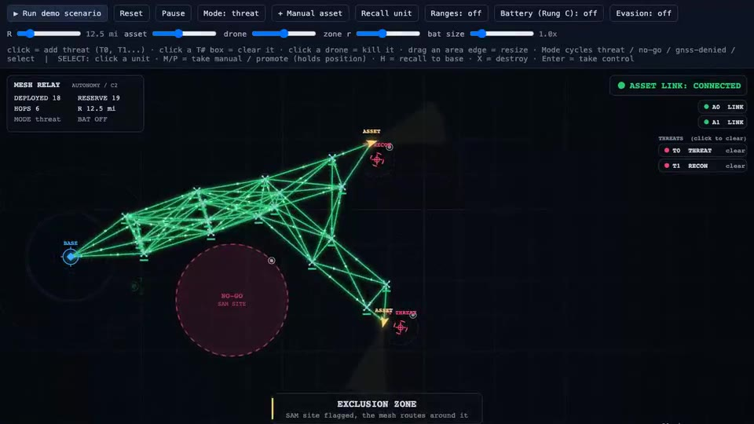

# Mesh Relay

**A swarm of relay drones that keeps a recon asset connected past radio range, and heals, reroutes, and rotates itself home with no operator in the loop.**

A 2D top-down browser simulation of the autonomy layer for a self-healing relay mesh. Built in a weekend at EDTH London (European Defense Tech Hackathon).

> **▶ [Try the live demo](https://mesh-relay.vercel.app/)** — click to place a threat, click a drone to kill it, drop a no-go zone, and watch the mesh react. Or hit **Run demo scenario** for the hands-free arc.

*▶ [Watch the full ~110s demo](demo.mp4), or [try it live](https://mesh-relay.vercel.app/) yourself.*

---

## The problem

Forward recon and ISR assets routinely operate past line-of-sight radio range. A single link to a distant asset is fragile: terrain, distance, jamming, or one downed relay drops it. Keeping that link alive today is manual and brittle, and it falls apart the moment something changes: the target moves, a node is lost, or a threat appears on the route.

## The idea

The answer is not a bigger radio. It is treating connectivity as something a swarm **actively maintains**. Relays fly in redundant pairs, anchor themselves so every hop stays in range, and continuously re-plan as the mission changes. The operator names the objective; the swarm works out how to stay connected to it.

## What it does

- **Self-organizing chain.** Send an asset toward a target past comms range and relays deploy from base to hold the link. Nobody places them.
- **Re-tasking.** Move the target mid-mission and the mesh re-optimizes itself around the new geometry.
- **Self-healing.** Kill one drone of a redundant pair and the link holds. Kill the whole pair and it drops, then self-heals in seconds as base launches replacements.
- **Threat avoidance.** Mark an exclusion zone and the relay chain routes around it, pulling any drone caught inside back out.
- **GNSS-denied operation.** Flag an area where drones lose GPS. Base radar plus multilateration locates them, and they fall back to avoid / inertial-return / reference-constellation behaviors.
- **Multiple assets.** Several assets draw from one shared drone pool, each with its own chain and area-search pattern, with editable area radii.
- **Operator control.** Select any unit to promote it (hold position), take manual control, recall it, or destroy it. Auto-promotion is deterministic.
- **Anti-triangulation.** Relays can wander cross-track so the base position cannot be triangulated from a static chain.
- **Endurance.** Each relay predicts when it must turn back, and the system relieves it early so the link never drops and the drone lands with battery to spare. Persistent overwatch, no human in the loop.

## How it works

TypeScript, Vite, and a single `<canvas>`, no framework. The sim runs on a deterministic fixed-step loop, so every run reproduces exactly.

It separates the autonomy "brain" from the renderer: relay placement, connectivity (a BFS within comms range), exclusion-zone routing, GNSS-denied multilateration, and battery-aware handover all live in the brain; the renderer only reads state, so the same view could later be driven by live telemetry instead of the sim.

### The autonomy is tested, not hand-waved

A headless regression drives the full mission and asserts the numbers:

- ~99% link uptime through the asset's transit
- kill-one-of-a-pair never drops the link; kill-the-pair drops then heals
- zero drones ever sit inside an exclusion zone
- 100% link uptime with battery autonomy on, and zero stranded drones
- byte-identical results across runs (determinism)

## Honest scope

This is a 2D simulation on a single laptop, an early proof of concept. It does **not** simulate RF physics or fly real hardware. What is real is the autonomy: the relay placement, self-healing, exclusion routing, multilateration, and battery-aware handover logic are implemented and verified by the headless test above.

Because the renderer reads from a single state source, swapping simulated positions for live telemetry over a real data-transport fabric is a contained change. The transport layer would carry the bytes; this layer makes the decisions. The two stay separate on purpose.

## Where it goes next

- Live telemetry feed in place of simulated positions (the single source swap).
- Real flight dynamics and battery models.
- Link-quality-aware relay placement and mixed asset types.

## Source

The source is kept private. This page and the [live demo](https://mesh-relay.vercel.app/) are the public showcase. Reach out if you would like a walkthrough.

Built with TypeScript, Vite, and [Claude Code](https://claude.com/claude-code).
